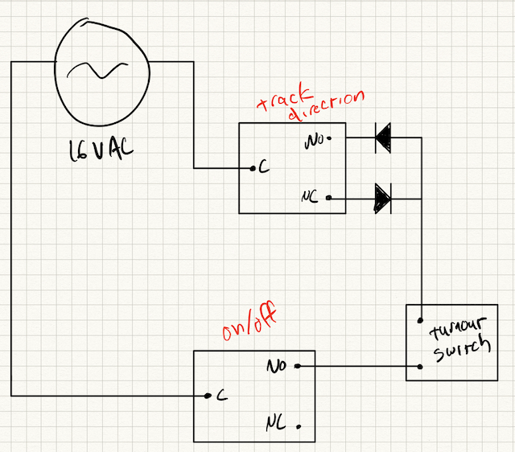

# traincon

Used to control AC model train switches via a Raspberry Pi.  API is compatible with Homebridge plugin.


This project uses [gb](https://getgb.io/) to build.  After installing `gb`, simply:

```
# build locally
gb build app/traincon
# build for raspberry pi
GOPATH=`pwd`:`pwd`/vendor GOOS=linux GOARM=7 GOARCH=arm go build app/traincon
./traincon
```

The routes are simple:

```
GET /toggle/{switchNum}
GET /on/{switchNum}
GET /off/{switchNum}
GET /status/{switchNum}
```

Right now everything's hardcoded. TODO would be to have this run via config.

It's meant to be used with the [Homebridge](https://github.com/nfarina/homebridge) plugin [homebridge-http-switch](https://github.com/Supereg/homebridge-http-switch).

Sample Homebridge config:

```
{
    "accessories": [
        {
            "accessory": "HTTP-SWITCH",
            "name": "Train Switch 1",
            "switchType": "stateful",
            "onUrl": "http://raspberrypi:8080/on/1",
            "offUrl": "http://raspberrypi:8080/off/1",
            "statusUrl": "http://raspberrypi:8080/status/1"
        }
    ]
}
```

## Wiring

Each turnout switch should be wired to two SPDT relays.  The relays are meant to simulate a momentary DPDT switch that is used to change the direction of the turnout.  Because they are powered using AC, you need to use two diodes as half-wave rectifiers to only allow the current to flow in the desired direction.

The code will change the direction of the track (the top relay), then momentarily energize the on/off relay to make the track move.


